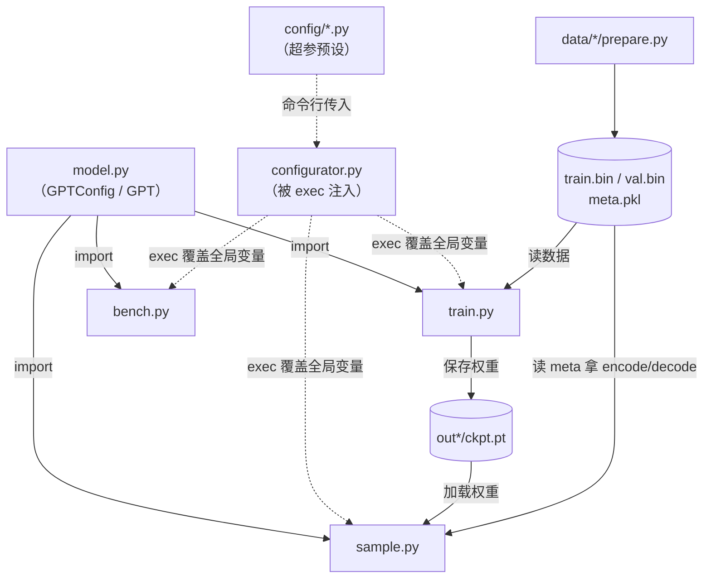
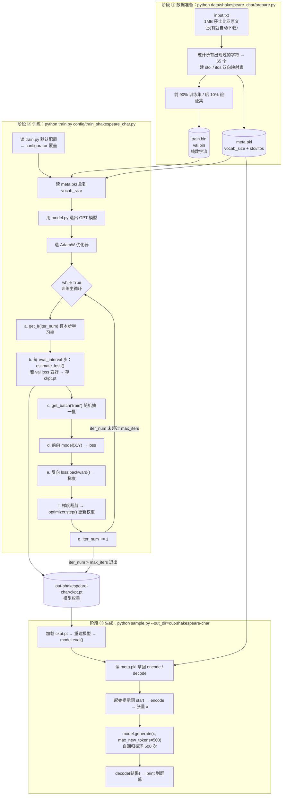
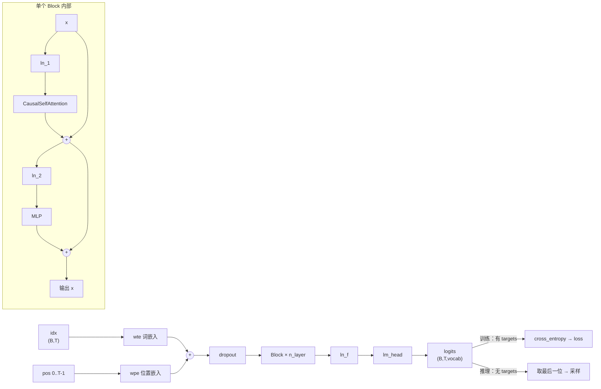

# nanoGPT 项目结构与运行流程解析（小白向）

> 本文档面向编程基础较薄弱的读者，目标是把 nanoGPT 这个项目**每个脚本干什么、主流程在哪、从头到尾怎么跑起来**讲清楚。
> 适配环境：Linux + zsh + RTX 3050 6G 显存 + Python 3.10（venv）
> 创建日期：2026-08-17

---

## 目录

1. [先看全景：这个项目是干什么的](#一先看全景这个项目是干什么的)
2. [目录结构与每个文件的职责](#二目录结构与每个文件的职责)
3. [主函数在哪？（最容易困惑的点）](#三主函数在哪最容易困惑的点)
4. [三阶段总流程图](#四三阶段总流程图)
5. [train.py 单步循环内部](#五trainpy-单步循环内部重点)
6. [model.py 的数据流：模型内部长什么样](#六modelpy-的数据流模型内部长什么样)
7. [configurator.py 这个&#34;黑魔法&#34;](#七configuratorpy-这个黑魔法要单独说)
8. [在本机实际能跑的命令](#八在本机实际能跑的命令)
9. [与&#34;终端命令补全&#34;项目目标的衔接](#九与终端命令补全项目目标的衔接)
10. [附：术语小词典](#附术语小词典)

---

## 一、先看全景：这个项目是干什么的

nanoGPT 是 Karpathy 写的**最小可用的 GPT 训练框架**。它做的事本质上只有三步：

```
原始文本  →  变成一串数字  →  训练模型去猜下一个数字  →  用模型生成新文本
（.txt）      （.bin）           （ckpt.pt 权重文件）        （打印到屏幕）
```

整个项目刻意写得很"扁"：**没有复杂的包结构、没有类工厂、没有配置框架**，全是几个平铺的脚本。
核心代码加起来只有约 900 行，这对学原理是极大的好事——你能把每一行都读完。

---

## 二、目录结构与每个文件的职责

```
nanoGPT/
├── model.py          ← 【核心】GPT 模型的定义（网络长什么样）
├── train.py          ← 【核心】训练脚本（主入口 1）
├── sample.py         ← 【核心】推理/生成脚本（主入口 2）
├── configurator.py   ← 配置覆盖的"小黑魔法"，被上面两个脚本 exec 进去
├── bench.py          ← 性能测速脚本，和学原理无关，可以先忽略
│
├── data/             ← 数据准备区，每个数据集一个文件夹
│   ├── shakespeare_char/prepare.py   ← 按【字符】切分（词表只有 65）
│   ├── shakespeare/prepare.py        ← 按【GPT-2 BPE 子词】切分（词表 50257）
│   └── openwebtext/prepare.py        ← 大规模网页语料（几十 GB，别碰）
│
├── config/           ← 一堆"超参数预设文件"，本质就是一段裸赋值语句
│   ├── train_shakespeare_char.py     ← 小模型训练预设（最该用这个入门）
│   ├── train_gpt2.py                 ← 复刻 GPT-2 124M（需要 8×A100）
│   ├── finetune_shakespeare.py       ← 在 GPT-2 上微调的预设
│   └── eval_gpt2*.py                 ← 只跑评估、不训练的预设
│
├── scaling_laws.ipynb        ← 分析用 notebook，与主流程无关
├── transformer_sizing.ipynb  ← 分析用 notebook，与主流程无关
├── assets/           ← README 里用到的图片
└── venv/             ← 自建虚拟环境，不属于项目代码
```

### 一句话记住谁是谁

| 文件                  | 角色比喻             | 说明                                                            |
| --------------------- | -------------------- | --------------------------------------------------------------- |
| `model.py`          | **图纸**       | 定义神经网络的结构和前向计算，被 train/sample/bench 共同 import |
| `train.py`          | **工厂**       | 反复喂数据、算误差、更新权重，产出`ckpt.pt`                   |
| `sample.py`         | **成品试用**   | 加载`ckpt.pt`，让模型写文章                                   |
| `data/*/prepare.py` | **原料预处理** | 把文字磨成模型能吃的数字（`.bin`）                            |
| `configurator.py`   | **旋钮转接板** | 让你在命令行改参数，而不用改源码                                |
| `config/*.py`       | **旋钮预设档** | 一整套调好的参数组合，一行命令套用                              |
| `bench.py`          | **秒表**       | 只测每步耗时和 GPU 利用率，不产出模型                           |

### 文件之间的依赖关系



---

## 三、主函数在哪？（最容易困惑的点）

**答案：这个项目没有 `main()` 函数，也没有 `if __name__ == '__main__':`。**

你去 `grep` 都找不到。它用的是**"脚本式"写法**——代码写在文件最外层（顶格、没有缩进），
执行 `python train.py` 时，Python 就从第 1 行一路往下执行到最后一行。

### `train.py` 的"主流程"就是文件本身的顺序

| 行号              | 在干什么                                                               |
| ----------------- | ---------------------------------------------------------------------- |
| 19-30             | `import`                                                             |
| 35-74             | **定义一堆全局变量当默认配置**（`batch_size = 12` 这种）       |
| 77                | `exec(open('configurator.py').read())` ← 用命令行参数覆盖上面的变量 |
| 82-112            | 判断是否多卡（DDP）、设随机种子、设数值精度                            |
| 116-131           | 定义`get_batch()` 函数（**只是定义，还没调用**）               |
| 134-144           | 初始化`iter_num`、读 `meta.pkl` 拿词表大小                         |
| 146-193           | 造模型（scratch / resume / gpt2 三种方式之一）                         |
| 196-212           | 造 GradScaler、优化器，可选`torch.compile`、包 DDP                   |
| 215-242           | 定义`estimate_loss()` 和 `get_lr()`（同样只是定义）                |
| **255-333** | **`while True:` 训练主循环** ← 真正的"主函数体"               |
| 335-336           | 收尾，销毁多卡进程组                                                   |

所以：**可以把 `train.py:255` 的 `while True:` 当成主函数**，前面 250 行全是准备工作。

> ### 小白知识点：定义 ≠ 执行
>
> Python 里 `def foo():` 只是"登记"一个函数名，不会执行函数体里的代码；
> 只有写 `foo()` 才真正跑起来。
> 所以读这种脚本时，先分清两类行：
>
> - **顶格、且不是 `def`/`class`/`import` 开头** → 真正按顺序执行的主流程
> - **`def` / `class` 及其缩进内容** → 只是登记，等被调用
>
> 按这个方法扫一遍 `train.py`，主流程立刻就浮出来了。

### 两个真正的"入口"

| 入口命令                             | 做什么                           | 产出                                   |
| ------------------------------------ | -------------------------------- | -------------------------------------- |
| `python data/<数据集>/prepare.py`  | 准备数据（每个数据集跑一次就够） | `train.bin` `val.bin` `meta.pkl` |
| `python train.py [config] [--k=v]` | 训练                             | `out*/ckpt.pt`                       |
| `python sample.py [--k=v]`         | 生成文本                         | 屏幕输出                               |

---

## 四、三阶段总流程图

### 4.1 Mermaid 版（可渲染成图）



### 4.2 ASCII 版（终端里直接看）

```
┌───────────────────────────────────────────────────────────────────┐
│  阶段 ①  数据准备        python data/shakespeare_char/prepare.py   │
└───────────────────────────────────────────────────────────────────┘
        input.txt (1MB 莎士比亚原文，没有就自动下载)
                    │
                    ├─ 统计所有出现过的字符 → 65 个 → 建 stoi/itos 映射表
                    │      ('a'→39, 'b'→40 ...)      (字符↔整数 互查字典)
                    │
                    ├─ 前 90% 当训练集，后 10% 当验证集
                    │
                    ▼
        ┌───────────┬───────────┬──────────────────────────┐
        │ train.bin │  val.bin  │        meta.pkl          │
        │(纯数字流) │(纯数字流) │(词表大小 + stoi/itos 映射)│
        └───────────┴───────────┴──────────────────────────┘
                    │                        │
                    │                        └──────────────┐
                    ▼                                       │
┌───────────────────────────────────────────────────────────┼───────┐
│  阶段 ②  训练   python train.py config/train_shakespeare_char.py  │
└───────────────────────────────────────────────────────────┼───────┘
                    │                                       │
   ┌────────────────┴────────────────┐                      │
   │ 1. 读默认配置 → configurator 覆盖│                      │
   │ 2. 读 meta.pkl 拿到 vocab_size ←─┼──────────────────────┘
   │ 3. 用 model.py 造出 GPT 模型     │
   │ 4. 造 AdamW 优化器               │
   └────────────────┬────────────────┘
                    ▼
        ╔═══════════════════════════════════════╗
        ║        while True 训练主循环          ║   ← 反复几千次
        ║                                       ║
        ║  a. 按 iter_num 算本步学习率 get_lr()  ║
        ║  b. 每隔 eval_interval 步：           ║
        ║       estimate_loss() 评估            ║
        ║       若变好 → 存 ckpt.pt ────────────╫──→ out-shakespeare-char/ckpt.pt
        ║  c. get_batch('train') 随机抽一批数据 ║
        ║  d. 前向 model(X, Y) → 得 loss        ║
        ║  e. 反向 loss.backward() → 得梯度     ║
        ║  f. 梯度裁剪 → optimizer.step() 更新  ║
        ║  g. iter_num += 1，超过 max_iters 退出║
        ╚═══════════════════════════════════════╝
                    │
                    ▼
┌───────────────────────────────────────────────────────────────────┐
│  阶段 ③  生成    python sample.py --out_dir=out-shakespeare-char   │
└───────────────────────────────────────────────────────────────────┘
        加载 ckpt.pt → 重建模型 → model.eval()
                    │
        读 meta.pkl 拿回 encode/decode（数字↔字符）
                    │
        起始提示词 start → encode → 张量 x
                    │
                    ▼
        model.generate(x, max_new_tokens=500)  ← 自回归循环 500 次
                    │
        decode(结果) → print 到屏幕
```

---

## 五、train.py 单步循环内部（重点）

一次迭代（iteration）里发生的事，画细一点：

```
   ┌──────────────────────────────────────────────────────────────┐
   │ get_batch('train')                            train.py:116   │
   │   从 train.bin 里随机挑 batch_size 个起点                     │
   │   X = data[i : i+block_size]      （输入：连续 256 个字符）   │
   │   Y = data[i+1 : i+1+block_size]  （答案：整体右移一位）      │
   └──────────────────────────────────────────────────────────────┘
                    │  X 形状 (batch, block)  例如 (64, 256)
                    ▼
   ┌──────────────────────────────────────────────────────────────┐
   │ logits, loss = model(X, Y)   →  进入 model.py 的 GPT.forward  │
   └──────────────────────────────────────────────────────────────┘
                    │  loss 是一个标量：预测错得有多离谱
                    ▼
   ┌──────────────────────────────────────────────────────────────┐
   │ loss = loss / gradient_accumulation_steps                    │
   │ scaler.scale(loss).backward()  ← 自动求导，算每个权重该怎么调 │
   │   （这一段套在 for micro_step 循环里，叫"梯度累积"：          │
   │     显存装不下大 batch，就分几次小 batch 累加梯度再更新一次） │
   └──────────────────────────────────────────────────────────────┘
                    ▼
   ┌──────────────────────────────────────────────────────────────┐
   │ clip_grad_norm_        ← 梯度太大就按比例缩小，防训练炸掉      │
   │ scaler.step(optimizer) ← 真正修改模型权重                     │
   │ optimizer.zero_grad()  ← 清空梯度，准备下一轮                 │
   └──────────────────────────────────────────────────────────────┘
```

### 几个关键概念（对 6G 显存尤其重要）

**1. 数据是怎么构造"题目和答案"的**

语言模型的训练任务就是"看前面猜下一个"。所以 `Y` 只是把 `X` **整体右移一位**：

```
X:  T  h  e     q  u  i  c  k
Y:  h  e     q  u  i  c  k  _
    ↑ 位置 0 看到 'T'，要预测 'h'
       ↑ 位置 1 看到 'Th'，要预测 'e'
                              ↑ 位置 8 看到 'The quick'，要预测 ' '
```

一个长度 256 的序列，一次前向就同时训练了 256 个预测任务——这是 Transformer 高效的原因之一。

**2. 梯度累积（gradient accumulation）**

等效批量 = `batch_size × gradient_accumulation_steps × 卡数`（见 `train.py:101`）。
显存不够时：**把 `batch_size` 调小、`gradient_accumulation_steps` 调大**，数学上近似等价于一个大 batch，但显存占用只按小 batch 算。

**3. 学习率调度（`get_lr`，train.py:231）**

```
学习率
  ↑
  │      ╱‾‾‾╲___
  │    ╱         ╲___
  │  ╱                ╲______  min_lr
  └──┬──────────────────────────→ 迭代数
     warmup_iters
   ① 线性预热        ② 余弦退火衰减        ③ 保持最小值
```

预热是为了避免一开始学习率太大把随机初始化的模型带崩；余弦衰减是为了后期精细收敛。

**4. `bfloat16` / `float16` 混合精度与 GradScaler**

用半精度算得更快、更省显存，但 `float16` 数值范围小，梯度容易变成 0（下溢）。
`GradScaler` 的作用是先把 loss 放大若干倍再反向，最后再缩回去。
`bfloat16` 范围大不需要它，所以 `train.py:196` 里只在 `dtype == 'float16'` 时启用。

**5. 什么时候存 checkpoint（train.py:263-286）**

只在 `iter_num % eval_interval == 0` 时评估并存盘，而不是每步都存。
`always_save_checkpoint=False`（小数据集预设的选择）表示**只有验证 loss 变好才存**，可以防止把过拟合后的坏模型覆盖掉好模型。

---

## 六、model.py 的数据流：模型内部长什么样

### 6.1 前向传播数据流

```
输入 idx：一批 token 编号，形状 (B=64, T=256)
   │
   ├─ wte 词嵌入表查表：每个编号 → 一个 384 维向量        (B,T,384)
   ├─ wpe 位置嵌入表：第 0/1/2...255 个位置 → 384 维向量   (T,384)
   │  两者相加（让模型知道"是什么词" + "在第几位"）
   ▼
┌──────────────── Block × n_layer（6 层，循环堆叠）───────────────┐
│                                                                 │
│   x = x + attn(ln_1(x))     ← 自注意力：每个位置去"看"前面的位置 │
│   x = x + mlp (ln_2(x))     ← 前馈网络：逐位置做非线性变换       │
│                                                                 │
│   注意这两行的 "x + ..." 是残差连接，让深层网络能训得动          │
│   CausalSelfAttention 里的 is_causal=True 保证                  │
│   "只能看左边、不能偷看未来"——这是 GPT 的灵魂                   │
└─────────────────────────────────────────────────────────────────┘
   │
   ├─ ln_f 最终归一化
   ├─ lm_head 线性层：384 维 → 65 维（词表大小）           (B,T,65)
   ▼
logits：每个位置上，对"下一个字符是谁"的打分
   │
   ├─ 训练时（传了 targets）：F.cross_entropy(logits, Y) → loss
   └─ 推理时（没传 targets）：只算最后一个位置的 logits，省算力
```

### 6.2 类的套娃关系

```
GPT                                       ← model.py:118
 ├── transformer.wte    词嵌入表 (vocab_size × n_embd)
 ├── transformer.wpe    位置嵌入表 (block_size × n_embd)
 ├── transformer.h = [Block × n_layer]    ← model.py:94
 │                    ├── LayerNorm ln_1                    ← model.py:18
 │                    ├── CausalSelfAttention（q/k/v 三件套）← model.py:29
 │                    ├── LayerNorm ln_2
 │                    └── MLP（两层全连接 + GELU）           ← model.py:78
 ├── transformer.ln_f   最终 LayerNorm
 └── lm_head            输出层 (n_embd → vocab_size)
```



### 6.3 `GPT` 类的方法清单

| 方法                          | 行号 | 作用                                             | 谁在用               |
| ----------------------------- | ---- | ------------------------------------------------ | -------------------- |
| `forward(idx, targets)`     | 170  | 前向计算，返回`(logits, loss)`                 | train.py / bench.py  |
| `generate(idx, n, ...)`     | 306  | 自回归生成文本                                   | sample.py            |
| `from_pretrained(type)`     | 207  | 从 HuggingFace 下载 OpenAI 官方 GPT-2 权重灌进来 | train.py / sample.py |
| `configure_optimizers(...)` | 263  | 造 AdamW，并区分"哪些参数该做权重衰减"           | train.py / bench.py  |
| `crop_block_size(n)`        | 195  | 把上下文长度剪短（"模型手术"）                   | train.py             |
| `get_num_params()`          | 150  | 数参数量                                         | 构造时打印           |
| `estimate_mfu(...)`         | 289  | 估算 GPU 算力利用率，纯监控                      | train.py / bench.py  |
| `_init_weights(m)`          | 162  | 权重初始化规则                                   | 构造时自动调用       |

### 6.4 `generate` 的自回归循环（model.py:306）

```
                ┌──────────────────────────────────────┐
                │  idx = 当前已有的 token 序列          │
                └──────────────────────────────────────┘
                              │
      ┌───────────────────────▼───────────────────────┐
      │ 1. 太长就裁剪到最后 block_size 个              │
      │ 2. 前向 → 取最后一个位置的 logits              │
      │ 3. logits / temperature                       │
      │      temperature < 1 → 更保守；> 1 → 更发散    │
      │ 4. top_k 截断：只保留最可能的 k 个，其余设 -inf │
      │ 5. softmax → 概率分布 → multinomial 随机采样   │
      │ 6. 采到的新 token 拼回 idx 末尾                │
      └───────────────────────┬───────────────────────┘
                              │  重复 max_new_tokens 次
                              ▼
                        完整生成序列
```

> 注意：这里是**每次都重新前向整段序列**，没有 KV Cache，所以生成慢。
> 这是 nanoGPT 为了代码简洁做的取舍——真要做交互式补全工具，这里是第一个要优化的点。

---

## 七、configurator.py 这个"黑魔法"要单独说

`train.py:77` 这一行很反常：


```python
exec(open('configurator.py').read())
```

它不是 `import`，而是把另一个文件的源码**当场读成字符串、就地执行**。
这样做的效果是：`configurator.py` 里的 `globals()[key] = value` 直接改的就是 `train.py` 自己的全局变量。
如果换成 `import configurator`，它改的就只是 configurator 模块自己的命名空间，对 train.py 毫无影响——这就是作者选择 `exec` 的原因（他自己在文件注释里也承认这写法"probably a terrible idea"）。

### 三层配置优先级

```
① train.py 里写死的默认值（最低）
        ↓ 被覆盖
② 命令行传入的配置文件：python train.py config/train_shakespeare_char.py
        ↓ 被覆盖
③ 命令行 --key=value：--batch_size=4 --device=cpu（最高）
```

`config/` 下那些文件因此**不是模块，只是一段裸赋值语句**——这也是为什么 `config/train_shakespeare_char.py` 里全是 `out_dir = 'xxx'` 这种光秃秃的行，没有函数、没有 class、也没人 import 它。

### 两个坑

1. **只能覆盖已存在的变量名**。拼错会直接 `raise ValueError: Unknown config key`（configurator.py:47）。
2. **类型必须一致**。`configurator.py:42` 有 `assert type(attempt) == type(globals()[key])`，
   所以默认值是 `0.0`（float）时，不能传 `--dropout=0`（会被解析成 int 而报错），要写 `--dropout=0.0`。

---

## 八、在本机实际能跑的命令

RTX 3050 只有 6G 显存，建议按下面这套跑通全流程：

```bash
cd ~/nanoGPT && source venv/bin/activate

# ① 准备数据（几秒钟；会自动下载 1MB 的 input.txt）
python data/shakespeare_char/prepare.py

# ② 训练（调小 batch/block 省显存；关掉 compile 避免首次编译踩坑）
python train.py config/train_shakespeare_char.py \
    --batch_size=32 --block_size=128 --compile=False

# ③ 生成
python sample.py --out_dir=out-shakespeare-char --device=cuda
```

### 显存不够时的调参顺序

出现 `CUDA out of memory` 时，按这个顺序往下调：

1. `--batch_size` 减半（32 → 16 → 8），同时 `--gradient_accumulation_steps` 翻倍，保持等效批量不变
2. `--block_size` 减小（256 → 128），上下文变短，显存占用大致线性下降
3. `--n_layer` / `--n_embd` 减小（6 → 4 层，384 → 256 维），这是真的把模型改小了
4. 最后才考虑 `--device=cpu`（慢几十倍，只适合验证代码能跑通）

### 暂时不用管的东西

| 对象                             | 原因                                 |
| -------------------------------- | ------------------------------------ |
| `bench.py`                     | 只是测速工具，不产出模型             |
| `config/train_gpt2.py`         | 目标是 8×A100 训 4 天               |
| `data/openwebtext/`            | 语料几十 GB，预处理就要很久          |
| `config/eval_gpt2*.py`         | 需要先下载 GPT-2 官方权重            |
| 两个`.ipynb`                   | 缩放定律/参数量分析，与主流程无关    |
| `train.py` 里所有 `ddp` 分支 | 单卡永远走`else`，`ddp` 为 False |

---

## 九、与"终端命令补全"项目目标的衔接

按 `PROJECT_NOTES.md` 里定的目标（用 nanoGPT 架构做终端命令智能补全），映射关系是：

| nanoGPT 的东西                                      | 你的项目里换成什么                                   | 改动量                                           |
| --------------------------------------------------- | ---------------------------------------------------- | ------------------------------------------------ |
| `data/shakespeare_char/input.txt`（莎士比亚原文） | 你的 zsh 历史命令语料                                | **需要新写** `data/shell_cmd/prepare.py` |
| 字符级 tokenizer（65 个字符）                       | 命令行字符集（字母+数字+`-/._` 等，可能 100 出头） | 沿用字符级思路即可，最简单                       |
| `model.py`                                        | **几乎一行都不用改**                           | 无                                               |
| `config/train_shakespeare_char.py`                | 复制一份改成`config/train_shell.py`                | 改几个数字                                       |
| `sample.py` 的整段生成                            | "给定前缀 → 只生成到换行符为止"的补全逻辑           | **需要改** `generate` 的停止条件         |

也就是说：**四个核心文件里，你真正要动的只有 `prepare.py` 和 `sample.py`。**

### 后续几个已经能预见的技术点

1. **数据格式**：需要把"最近几条历史命令 + 当前前缀"拼成一个训练样本，比如用特殊分隔符
   `cmd1\ncmd2\ncmd3\n<当前命令>` 的形式，让模型自然学到"看前几条猜这条"。
2. **提前停止**：补全一条命令时不该生成 500 个 token，应该在生成到 `\n` 时立刻停。
3. **贪心而非采样**：补全场景要的是"最可能的那一个"，所以应该取 `argmax` 而不是 `multinomial` 随机采样
   （即 `temperature` 趋近 0 的效果）。
4. **延迟**：Tab 补全要求毫秒级响应。当前 `generate` 没有 KV Cache，且每次要重新加载模型——
   最终形态需要一个常驻后台进程 + KV Cache 优化。

---

## 附：术语小词典

| 术语                               | 通俗解释                                                      |
| ---------------------------------- | ------------------------------------------------------------- |
| **token**                    | 模型眼里的最小文字单位。字符级就是一个字符，BPE 级是一个子词  |
| **vocab_size**               | 词表大小，即一共有多少种不同的 token                          |
| **block_size**               | 上下文长度 / 最多能往前看多少个 token（也叫 context length）  |
| **batch_size**               | 一次并行处理多少条序列                                        |
| **n_embd**                   | 每个 token 用多少维向量表示（embedding 维度）                 |
| **n_layer**                  | 堆了几层 Block                                                |
| **n_head**                   | 注意力被拆成几个"头"并行看不同关系                            |
| **iteration（迭代）**        | 完成一次"前向 + 反向 + 更新权重"叫一步                        |
| **logits**                   | 模型输出的原始打分（未归一化），越大表示越可能                |
| **loss（损失）**             | 预测和真实答案的差距，越小越好。训练就是在最小化它            |
| **forward（前向）**          | 数据从输入流到输出、算出 loss 的过程                          |
| **backward（反向）**         | 从 loss 倒推每个权重该怎么调（自动求导）                      |
| **optimizer（优化器）**      | 拿着梯度真正去修改权重的算法，这里用 AdamW                    |
| **learning_rate**            | 每次调整权重的步子大小                                        |
| **weight decay**             | 一种正则化，防止权重变得过大导致过拟合                        |
| **checkpoint / ckpt.pt**     | 训练存档，含模型权重 + 优化器状态 + 迭代数                    |
| **过拟合**                   | 训练集 loss 一直降但验证集 loss 反升，模型在死记硬背          |
| **train / val split**        | 训练集用来学，验证集只用来考试，防止自欺欺人                  |
| **autoregressive（自回归）** | 生成时把自己刚吐出的 token 当输入再喂回去，一个个往后接       |
| **temperature**              | 采样"温度"。低=保守重复，高=天马行空                          |
| **top_k**                    | 只从概率最高的 k 个候选里采样，防止选到离谱的词               |
| **DDP**                      | 多卡分布式数据并行，单卡用不到                                |
| **MFU**                      | Model FLOPs Utilization，GPU 算力利用率，越高越说明没浪费显卡 |
| **memmap**                   | 把大文件"映射"成数组，按需读磁盘，不用整个装进内存            |
