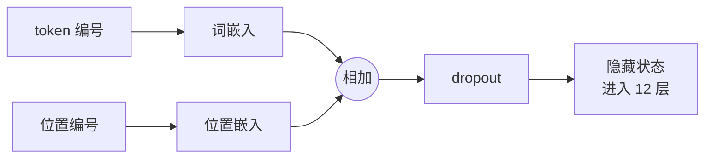
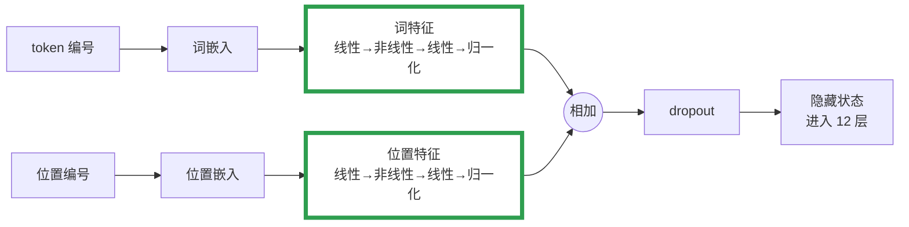
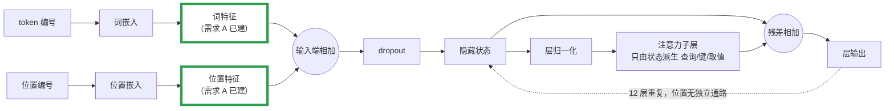
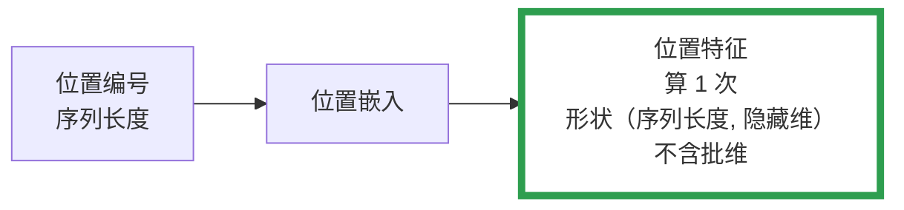
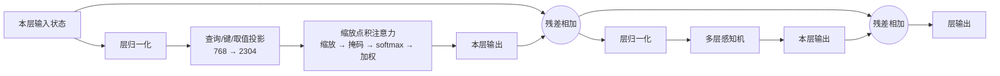
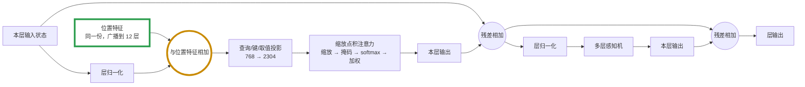
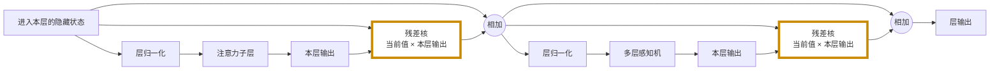

# 优化方案存档

## 📋 文档说明

> 本节是本文档的最高约定，与正文冲突时以本节为准。

**定位。** 把本项目从"跟随 nanoGPT 的标准实现"演进为带有自定义创新的实验模型。

**硬性约束。** 所有方案必须同时满足：① **可实现**；② **可 AB 对照**——能切回原结构；③ **可独立开关**——三个需求互不依赖。

**需求之间的依赖顺序。** 后序需求的设计基线是**前序需求改完之后的状态**，不是原始代码。需求 B 建立在需求 A 之上，其「现有结构」图与流程描述画的都是叠加后的形态。因此排期上 A 必须先于 B，实验数据也必须在同一基线上跑。叠加后能否复用前序需求已有的组件，要写进该需求的「参数量影响」并说明取舍。

**体例。** 每个需求固定两段，段内用 `**粗体标签**` 点题接文段，**不用 `####` 及更深层级**。

| 段 | 写什么 |
|---|---|
| **需求提出** | 固定三小点：**背景**（为什么提这个需求）→ **现有结构**（改动的是哪处结构、现状是什么）→ **需要改动的地方**（改动方向与结论） |
| **方案设计** | **需要改什么功能** → **参数量影响**（加了多少、加了百分之多少）→ 可能受影响的功能或代码 → 判定标准 → **为什么选这个方案（面试话术）**（可选，当前仅需求 B 写） |
| **实施细节** | **当前留空**，实现时补全：文件 · 类 · 函数 · 行号 · 每处怎么改 · 改动顺序 · 实现中发现的连带影响 |

- **需求提出只保留结论，不保留推导过程。** 讨论中的推理链、被驳倒的中间观点一律不进文档，只留最终成立的那句话。
- **方案设计只讲功能层面：不写文件名与行号、不贴源码。** 定位信息由需求提出现状承载；必要时可保留一行数学式（如残差核的矩阵形式），它既不是代码也不是文件。
- **需求提出允许用流程图**，且必须成对出现：**现有结构图 + 改后结构图**。图只画**被改动的区域**，不展开完整前向过程；框内用中文功能名，不写代码标识符。改后图中新增或替换的环节需高亮，便于一眼看出改动面。
- **受影响的范围要显式列出**，包括被破坏的既有功能、被牵连的调用方、以及与其他需求的开关互斥——这些是实现时最容易漏的部分。
- **叙述以"我们怎么做"为主体**：直白写本方案的做法，不在主体段落里展开别人怎么做，也不强调"我们没有做什么"。
- **别人的做法只放在文段末尾**，单起一段作对比，用来说明差异，不作为论证前提。
- **对比只写原理，不写结论。** 并列各方案的"位置以什么形式存在、在哪一步、以什么运算进入网络"，**不写"谁更好、谁的指标更优"**——优劣由实验判断，不由文档预设。
- **面试话术段**用来把本方案讲给面试官听：先讲我们怎么做 → 再讲为什么这么做 → 末尾一句带过其它做法。写成可口述的口吻，不堆术语、不列要点堆砌。
- **行号引用必须真实**，写前核对源码当前内容。
- **⚠️ 标记未经实验验证的判断**，不写成结论。

**编号。** 需求 A / B / D 沿用历史，不重排（原需求 C 已折入需求 A 作为理论依据）。

**实施细节**段在实现时逐个补全，粒度约定：定位到**文件 · 类 · 函数**并附行号，写清每处"改成什么"，但不写整段源码。

**状态。** 需求 A、B 已在代码中实现（开关默认关闭），尚未做实验验证（设备不允许实验）；需求 D 未实施。三个需求的**实施细节**段随实现逐个补全。

---

## 0. 核心主线

1. 输入状态不应是"语义向量 + 位置向量的一次性相加"，而应是**各因子先独立抽象、再在统一量纲下合成**。
2. 直接相加忽略了不同因子的**单位 / 量纲差异**。
3. 绝对位置编码**依赖参考系**（窗口起点）：同一句中的同一个词，会因取样窗口不同被分配不同的位置向量——这是矛盾信号。
4. 相对距离类方法是"退化"：要从 **A 的绝对信息**推断 A 与任意 B 的关系，而不是学一张"(相对距离 → 影响)"的表。

这四条是同一理念的不同侧面：**状态是因子独立抽象后合成的，影响是因子特征的内积分解而来。** 三个需求是它的三次落地。

---

## 需求 A：双分支归一化混合（反对"直接相加"）

### 需求提出

- **背景。** 语义向量与位置向量的尺度、分布不同（量纲不同），直接相加等于默认两者地位相等、可直接相加。需求目标是让各因子**先独立抽象、再在统一量纲下合成**。这是三个需求里改动最小、开关最干净的一个，也是需求 D（残差里 24 处直加）的前提论证。
- **现有结构。** 改动点是 `GPT.forward` 的**输入端**：词嵌入与位置嵌入两路查表结果**未经任何变换直接相加**，相加后才 dropout（`model.py:384-386`）。之后 12 层 Block 拿到的是已混合的向量，只能靠非线性反解哪部分是语义、哪部分是位置，没有任何机制**强制**解耦。

**图 1 · 需求 A · 现有结构**



- **需要改动的地方。** 把输入端的一次直加，改为**两路各自完成因子级抽象与归一化后再相加**。两条硬结论：① **LayerNorm 是必需项**——量纲对齐靠它（两路同为"零均值、单位方差"），去掉只留 MLP 等于没解决问题；② **MLP 必须有非线性**——无激活的两层线性映射乘积仍是一个线性矩阵，两路求和仍是线性系统，抽象无从谈起。

**图 2 · 需求 A · 改后结构**



### 方案设计

**需要改什么功能。** 新增一个可复用的「因子分支」组件：把一路输入经"线性变换 → 非线性激活 → 线性变换 → 归一化"映射到与嵌入同量纲的空间。输入端改为：**语义分支与位置分支各自过一遍该组件，两路结果归一化后相加**，再走原有的 dropout。两路分支参数**完全独立**，不共享——共享会强制它们同构，等于退回"同一套变换处理两种量纲"。原始的"直接相加"作为对照模式保留，可通过开关切回。

**参数量影响。** 新增的是一个"线性 → 非线性 → 线性 → 归一化"的分支组件（两层带偏置的线性映射 + 一层归一化）。按嵌入维 `C = 768`、偏置与现有层一致计算：**单分支 1,182,720 个参数**，语义与位置各一条，合计新增 **2,365,440** 个参数。基线参数量 124,475,904，因此**总量 124.48M → 126.84M，增幅 +1.90%**。待消融的两个维度：分支隐藏维的取值（直接决定上述数字，隐藏维翻倍则新增参数也翻倍）；两路权重是否共享（共享可省掉一半，+1.90% → +0.95%，但会强制两路同构，等于退回"同一套变换处理两种量纲"，**默认不共享**）。

**可能受影响的功能或代码。**

- **外部预训练权重的导入会被破坏。** 改动会使模型参数的组织结构变化，凡依赖固定参数键名做映射与校验的加载路径（从 GPT-2 等公开权重初始化、用其微调）都会失配——包括键名转换表与加载时的存在性断言。这是最容易被忽略、且**不会报错在改动处而报错在远处**的一项。
- **权重衰减分组。** 新增分支参数需按现有惯例归入正确的优化器分组，否则归一化权重与偏置项可能被错误地施加权重衰减。
- **采样生成。** 生成复用同一次前向，输入端状态改变会直接改变采样结果，基线样本不再可比。
- **配置注入。** 新增开关若未在训练配置中显式声明，配置系统会把未知键按字符串写入，导致开关判断恒真——**故障表现为"开关关着也生效"**。

**判定标准。** 固定随机种子与固定步数，对比训练 / 验证 loss 曲线与收敛速度；持续更低且未出现过拟合迹象则保留，否则切回原形态。⚠️ **阈值待补**——需先跑一次基线才能把"持续更低"变成可判定的数字。**本轮不做**：不追求推理速度、不追求参数量不增。

### 实施细节

**新增组件。** `model.py:245` 新增 `FactorBranch(torch.nn.Module)`：`__init__` 内建 `up_projection`（`Linear(C → H)`）、`gelu_activation`、`down_projection`（`Linear(H → C)`）与 `normalization`（复用现有 `LayerNorm`）；`forward` 固定为「线性 → GELU → 线性 → 归一化」。降维层命名为 `down_projection` 而非 `output_projection`，以避开 `model.py:374` 处按 `endswith('output_projection.weight')` 施加的残差缩放初始化，使分支走常规 `N(0, 0.02)`（由 `GPT.__init__` 里已有的 `self.apply(self._initialize_weights)` 覆盖）。

**开关声明。** `model.py:314` 起在 `GPTConfig` 增加三个字段：`use_dual_branch_input = False`（总开关，默认关 = 原直加）、`factor_branch_hidden_dimension = 0`（0 表示跟随 `embedding_dimension`）、`share_factor_branch_weights = False`（消融维度，默认不共享）。对应 `train.py:101` / `train.py:103` / `train.py:105` 三个顶层全局，供 `configurator.py` 用 `--KEY=value` 或配置文件覆盖。

**模型接线。** `GPT.__init__`（`model.py:339-345`）：开关开时按是否共享注册 `token_factor_branch` / `position_factor_branch`（共享时只注册 `shared_factor_branch`）；开关关时不注册任何新模块，`state_dict` 与基线逐键一致。`GPT.forward`（`model.py:434-441`）：开关开时两路各自过分支后相加，再走原有 `embedding_dropout`；关闭时保持原有直加。

**训练脚本接线。** ① `train.py:387-389` 把三个字段写入 `model_arguments`，否则开关只改了全局、`GPTConfig` 仍取默认值（配置文件路径下会静默不生效）；② `train.py:441-443` 加入 resume 的「强制一致」列表，因为它们决定参数键集合；③ `train.py:495-497` 加入 gpt2 分支的配置回读列表，使检查点记录开关状态；④ `train.py:478` 增加守卫：`INITIALIZE_FROM` 为 `gpt2*` 且开关打开时直接报错——GPT-2 预训练权重没有分支参数，不拦住会静默失效。

**前置修复（连带）。** `model.py:18` 增加 `from __future__ import annotations`。原代码在 `GPTConfig` 定义之前用其作为方法注解（如 `model.py:98`），属于前向引用，导入即抛 `NameError`——这是本次改动前就存在的阻塞性缺陷，不修则任何脚本都跑不起来。

**优化器分组。** 无需改动：`configure_optimizers`（`model.py:589-590`）按 `parameter.dim() >= 2` 分组，分支的 `Linear` 权重自动进衰减组，`Linear` 偏置与 `LayerNorm` 权重 / 偏置自动进不衰减组。

**改动顺序。** 前置修复 → `FactorBranch` → `GPTConfig` 字段 → `GPT.__init__` → `GPT.forward` → `train.py` 四处接线。

**验证（CPU 冒烟，未训练）。** 基线 raw 参数量 `124,475,904`，开启后 `126,841,344`，增量 `2,365,440`（+1.90%），与方案设计一致；开关关闭时 `state_dict` 无新增或删除的键；共享模式新增参数恰为不共享的一半。以上为形状与参数量的冒烟结论，**不代表**「量纲对齐带来可测优势」——该假设仍待实验。

---

## 需求 B：绝对位置特征注入注意力

### 需求提出

- **背景。** 绝对位置编号**依赖参考系**：同一句中的同一个词会因取样窗口起点不同而被分配不同的位置向量，但它的身份与语义是固定的。位置目前只在输入端与语义混合一次，此后 12 层内部没有独立通路参与计算，只能靠残差被动下传。需求目标是让位置特征成为一条独立通路，逐层参与注意力，并让内容与位置的交叉作用完整保留。
- **现有结构。** ⚠️ **本需求的基线是需求 A 改完之后的状态**，不是原始代码——即位置与语义已各自经过因子分支、在输入端归一化后相加。改动点仍有两处：① 位置嵌入的分支输出只在输入端用了一次，此后不再参与计算；② 全部 12 层注意力均从层归一化后的状态派生 Q/K/V（`model.py:192-204`），位置**在网络内部没有任何通路**。位置在输入端与语义混合之后只能靠残差被动下传，越深的层越难区分"这是位置信息还是语义信息"。

**图 3 · 需求 B · 现有结构（需求 A 之上）**



- **需要改动的地方。** ① 位置特征在主网络里**只算一次**：位置编号经位置嵌入与因子分支，得到形状为（序列长度, 隐藏维）的特征，**不含批维**，随后广播给每一层。② **每一层**的注意力内部，各自做一次层归一化，再与这份位置特征相加，然后派生查询 / 键 / 取值——12 层各做各的，用的是同一份位置特征。③ 位置特征以**直接加法**并入，四项交互（语义×语义、语义×位置、位置×语义、位置×位置）全部保留。位置只作用于注意力分数的计算，取值投影与输出投影沿用现有流程。

**图 4 · 需求 B · 位置特征生成（只算一次）**



**图 5 · 需求 B · 改前：每个 Block 内部**



**图 6 · 需求 B · 改后：每个 Block 内部（×12 层各做各的）**



| 操作 | 在哪里执行 | 执行次数 |
|---|---|---|
| 位置特征计算（位置嵌入 → 因子分支 → 归一化） | 主网络入口，所有 Block 之前 | **1 次** |
| 层归一化 → 与位置特征相加 → 派生查询 / 键 / 取值 | 每个 Block 内部 | **12 次** |

**对比（只对比原理，不比较优劣）。** 五种做法的差别只在两件事：**位置以什么形式存在**，以及**它在哪一步、以什么运算进入网络**。

| 方案 | 位置参数放在哪 | 以什么运算进入 | 位置信息的形式 | 进入 Q/K/V 吗 |
|---|---|---|---|---|
| 输入端绝对位置嵌入 | 输入端的嵌入表 | 加法，只加一次 | 每个位置一个向量 | 否，只改输入 |
| RoPE | 无参数 | 乘法（按位置角度旋转） | 每个位置的旋转角 | 只改查询与键 |
| ALiBi | 每个头一个斜率 | 加法（距离 × 斜率） | 标量偏置 | 否，只改分数 |
| T5 分桶偏置 | 桶 × 头的嵌入表 | 加法（按距离桶查表） | 离散的标量 | 否，只改分数 |
| **本方案** | 位置分支 + 可选投影 | 加法（位置特征向量） | 每个位置一个向量 | 查询与键（V1 含取值） |

### 方案设计

**需要改什么功能。** 前提是需求 A 已经改完——输入端已经是"两路分支归一化后相加"。在此之上新增一个「位置特征」的传递通路：**位置特征在主网络里只算一次**，形状与序列位置一一对应（不含批维），随后广播到每一层。每一层注意力内部，在派生查询 / 键之前把这份特征与层归一化后的状态相加。**缩放、因果掩码、softmax、取值投影与输出投影全部不动**——位置只参与"谁关注谁"的计算，不参与"取什么值"。

**位置特征从哪来（关键设计决策）。** 需求 A 已经有一条归一化后的位置分支输出，维度正是需要的维度。两种取法：

| 取法 | 做法 | 边际参数 |
|---|---|---|
| **复用 A 的位置分支**（`POS_SHARE_A_BRANCH`） | 直接把 A 的位置分支输出接一份到注意力通路 | **+0** |
| **独立另建**（默认） | 新建一份同样的分支组件 | **+1,182,720（+0.95%）** |

**默认选"独立另建"，即使复用能省 0.95%。** 原因是复用会让两个需求的梯度流进同一份权重——一旦打开需求 B 的注意力通路，需求 A 的位置分支输出也随之改变，此时**无法把两者的效果分开归因**，违反"可独立开关"这条硬约束。只有在 A、B 都通过实验确认要保留、且不再需要单独归因时，才切到复用模式作为最终形态。

**参数量影响。** 基线 124,475,904。在**需求 A 之上**叠加时：

| 组合 | 新增 | 总量 | 增幅 |
|---|---|---|---|
| 仅需求 A | 2,365,440 | 126.84M | +1.90% |
| **A + B（独立另建，默认）** | **3,548,160** | **128.02M** | **+2.85%** |
| A + B（复用 A 的位置分支） | 2,365,440 | 126.84M | +1.90% |

如果改为**逐层各持一份位置特征**（待消融维度，默认不做），新增乘以层数，变成 14,192,640 个、**+11.40%**。

注入方式分两档：**V1** 把位置特征与层归一化后的状态在注意力入口相加，位置同时进入查询 / 键 / 取值，**改动只有一处**；**V2** 使位置**只**进入查询与键、不进入取值，代价分两种做法——把现有融合投影**拆成三个独立投影**是数学等价的重构，在 A+B 之上仍是 **+0**；或保留融合投影、**另加两个投影器**，每层新增 1,181,184 个、×12 层合计 **+14,174,208（+11.39%）**，总量达到 142.03M（**+14.10%**）。**参数敏感的话，A + B-V1 + 独立位置特征（+2.85%）是合理上限。**

**为什么满足形式要求。** 位置加在投影**之前**。因为投影是线性的（`W(x+p) = Wx + Wp`），位置项不会被消掉，而是被搬进查询与键：

```
Q_i = W_q·(x_i + p_i) = W_q·x_i + W_q·p_i
K_j = W_k·(x_j + p_j) = W_k·x_j + W_k·p_j
```

分数是查询与键的内积，代入后展开为四项（下表为书写简洁，`x`、`p` 均指**投影之后**的版本）：

| 项 | 含义 | 现状 |
|---|---|---|
| `x_i·x_j` | 内容 × 内容 | 已有 |
| `x_i·p_j` | 内容查询 × 位置键 | **新增** |
| `p_i·x_j` | 位置查询 × 内容键 | **新增** |
| `p_i·p_j` | **纯位置交互——"绝对影响"项** | **新增** |

四个跨位置交互项全部保留，未做任何消元。

**可能受影响的功能或代码。**

- **注意力模块的接口变化。** 注意力子层与块级前向都要新增位置特征入参，唯一调用方是块级前向；但性能基准脚本若直接调用注意力子层，需同步改签名，否则会在实现阶段才暴露。
- **与需求 A 的耦合有两处，都必须显式处理。** ① **梯度耦合**：复用 A 的位置分支会让两个需求共享权重、无法分别归因，所以默认独立另建。② **开关互斥**：「位置完全不进输入端」与「双分支归一化输入」在语义上冲突——两者同开时需求 A 的位置分支失去存在意义、方案退化为"只用语义分支"，**需求 A 实际上没有被测试**。该格在对照矩阵中应直接标记为"不适用"。
- **对照实验的先后顺序。** 因为本需求建立在 A 之上，**需求 A 必须先完成并跑出基线**，需求 B 才能在同一基线上叠加。若要单独测量 B 的绝对贡献，则需在 A 关闭的状态下另跑一份，代价是两倍实验量。
- **权重衰减分组。** V2 新增投影的偏置项需与现有一致，不施加权重衰减。
- **保留输入端相加的消融开关。** 该开关是验证"位置只放注意力是否足够"的唯一手段，不能省。

**判定标准。** 开关矩阵 `{直接相加, 双分支} × {位置只进输入, 只进注意力, 都进}`，固定种子与步数比验证 loss。⚠️ 除 loss 外**必须额外看两件事**，只看 loss 会漏掉失败模式：删掉输入端相加后低层语义是否丢失位置信息（需低层注意力图）；绝对位置交互项是否真被优化器利用、而非被其余三项淹没忽略（需注意力图或梯度佐证）。**本轮不做**：不改上下文窗口长度，不追求长度外推。

**为什么选这个方案（面试话术）。**

> 我们的做法是：位置特征在主网络里只算一次，然后送进每一层注意力——加在查询 / 键 / 取值投影的输入上。这样位置在每一层都能重新参与"谁该关注谁"的计算，而不是只在最底部出现一次。
>
> 选它有三个理由。
>
> 第一，**位置项在分数里是可分离的**。加法进查询和键之后，注意力分数会展开成四项——内容对内容、内容对位置、位置对内容、位置对位置。也就是说，位置与内容的关系、位置与位置的关系各自是独立的一项，能直接观察、能单独分析。如果位置只在输入端加一次，它会先和内容混在一起、再一起做归一化，这两类关系就拆不开了。
>
> 第二，**改动面最小**。只改投影的输入，加一项，一个开关就能切回原结构，参数量只涨 0.95%。
>
> 第三，**和另一个改动是同一套思路**。输入端那边，我让语义和位置各自归一化之后再合成；这里也是位置特征带着自己的归一化，和归一化后的内容相加——都是"各因子先独立处理、再在统一量纲下合并"。
>
> 其它做法我也看过。最传统的是把位置嵌入加在输入端、只加一次；相对位置那一类，有的是把位置变成旋转角乘进查询和键，有的是在分数上加一个和距离有关的偏置，或者把距离分桶之后查表。它们的差别，都在位置以什么形式存在、在哪一步进入计算。

### 实施细节

**复用组件。** 位置特征与 A 的因子分支同构，直接复用 `model.py:245` 的 `FactorBranch`，不新增类。

**开关声明。** `model.py:326` 起在 `GPTConfig` 增加三个字段：`inject_position_into_attention = False`、`position_feature_hidden_dimension = 0`（0 表示跟随 `embedding_dimension`）、`share_a_position_branch_for_attention = False`（复用 A 的位置分支）。对应 `train.py:109` / `train.py:111` / `train.py:113` 三个顶层全局。

**位置特征的生成（只算一次）。** `GPT.forward`（`model.py:470-475`）：B 打开时，用 `attention_position_branch` 把原始位置嵌入（`position_embeddings`，形状 `(序列长度, 嵌入维度)`、**不含批维**）映射为位置特征；若 `self.share_position_feature` 为真（复用 A 的位置分支）则直接取 A 的位置分支输出 `position_branch_output`，不再另算。`model.py:477-478` 把同一份 `position_feature` 传给每个 Block。

**模型接线。** `GPT.__init__`（`model.py:360-368`）：计算 `self.share_position_feature`——要求 B 打开、`share_a_position_branch_for_attention` 打开、A 打开且两路分支独立；仅在不复用时才注册 `attention_position_branch`（`FactorBranch`）。`Block.forward`（`model.py:292-293`）新增 `position_feature` 入参并透传给注意力。`CausalSelfAttention.forward`（`model.py:159-164`）新增同名入参，在**层归一化之后、QKV 投影之前**相加——位置因此同时进入查询 / 键 / 取值（V1）。缩放、因果掩码、softmax、取值投影与输出投影全部未动。

**训练脚本接线。** `train.py:398-400` 把三字段写入 `model_arguments`；`train.py:455-457` 加入 resume 强制一致列表；`train.py:512-514` 加入 gpt2 回读列表；`train.py:492` 的守卫条件补上 `INJECT_POSITION_INTO_ATTENTION`。

**连带影响。** ① 注意力子层与块级前向的签名都新增了带默认值的 `position_feature` 入参，`bench.py` / `sample.py` 均经由 `GPT.forward` 间接调用，无直接调用方需改。② 与 A 的开关互斥：`share_a_position_branch_for_attention` 仅在 A 打开且两路独立时生效，否则自动退回独立另建；「位置完全不进输入端」与「双分支归一化输入」同开的那一格标记为不适用。③ 权重衰减分组无需改：复用 A 分支时无新增参数，独立另建时新分支的 `Linear` 权重 / 偏置同样被 `configure_optimizers` 按维度自动分组。

**改动顺序。** `CausalSelfAttention.forward` → `Block.forward` → `GPTConfig` 字段 → `GPT.__init__` → `GPT.forward` → `train.py` 四处接线。

**验证（CPU 冒烟，未训练）。** 基线 `124,475,904`；仅 B 独立另建 `125,658,624`（+1,182,720，+0.95%）；A + B 独立另建 `128,024,064`（+3,548,160，+2.85%）；A + B 复用 A 的位置分支 `126,841,344`（边际 +0，合计 +1.90%）。七种开关组合前向均通过，开关关闭时无新增键。⚠️ 以上仅为形状 / 参数结论；「位置只进注意力且删输入端相加后低层语义不丢位置信息」「绝对位置交互项真被优化器利用」仍待实验（低层注意力图 / 梯度佐证）。

---

## 需求 D：不对称交叉残差（内容 × 层输出的交互混合）

### 需求提出

- **背景。** 残差是全模型数量最多的加性路径（12 层 × 2 处 = **24 处**），至今仍是朴素直加——与需求 A 批评的"未经抽象的直加"是同一个病，只是发生在网络内部，且与主线"影响是因子特征的内积分解"不自洽。它是三个需求里改动最大、成本最高的一个，因此排到最后，并**先做低成本版本验证二值猜想**。
- **现有结构。** 改动点是块级前向的**两处残差**（`model.py:259-262`）：注意力残差与 MLP 残差都是"当前值直接加上本层输出"。本层输出被无差别按原样加到当前值上，没有"这一步该接收多少、以什么权重接收"的表达——注意力输出是全局混合的、MLP 输出是逐位置的，残差对两者一视同仁。

**图 7 · 需求 D · 现有结构**


- **需要改动的地方。** 把两处残差从朴素直加改为**内容驱动的交互式混合**：混合权重由"进入本残差前的当前值"与"本层输出"交互决定，且**不复用位置特征**（与需求 B 解耦，核纯由内容驱动）。两条结论：① **必须分版本**——全交叉核 `O(B·T²·C)` 约为同位置门控 `O(B·T·C)` 的 **1000 倍**，先用低成本门控验证"交互式残差是否有用"这个二值猜想，再上全交叉；② **混合权重不能只由位置决定**——第一版把核设计成纯位置内积已被否决：与内容无关的加权不叫交互，叫位置偏置。

**图 8 · 需求 D · 改后结构**



### 方案设计

**需要改什么功能。** 新增一个「残差核」组件：输入当前值与本层输出，输出一份混合增量，加到当前值上。核的形式为

```
x ← x + softmax( x @ Fᵀ / √C ) @ F
```

即**第一因子取进入本残差前的当前值，第二因子取本层输出**。因此 `s_ij ≠ s_ji`——信息从本层输出**单向流入**当前值，不是对称相似度，**不与块内注意力（内容 × 内容）语义重复**。注意力残差与 MLP 残差各用一个核，两处统一改写。

**三条性质。** ① **恒等先验**：混合增量乘在本层输出上，本层输出为零时退回当前值，保留"我不动"这个安全默认。② **数值稳定（仅全交叉版）**：逐行 softmax 归一后，增量是各位置增量的凸组合，无新增可调超参。③ **解耦声明**：不复用位置特征，核纯由内容驱动，与需求 B 完全独立。

**参数量影响。** 核有三种形态，**都不含任何可学习参数**——混合只是矩阵乘法与逐行 softmax，`√C` 是常数缩放而非参数。因此**参数量增幅为 0**；需要额外缩放系数的 **V3** 也只多 24 个标量（每处残差 1 个 × 24 处），可忽略。三者区别只在计算量：**V1 跨位置全交叉**（上式，`O(B·T²·C)`，主方案）、**V2 同位置门控**（`O(B·T·C)`，约 V1 的千分之一，用于先验证二值猜想）、**V3 去 softmax 的线性全交叉**（需额外缩放系数，数值不稳，仅作对照）。

**本需求的代价完全不在参数上，而在算力与显存**：全交叉形态每处需要一张与序列长度平方成正比的交互矩阵，跨 24 处残差累加。**与需求 A / B 正好相反——那两个是"零算力、纯参数代价"，需求 D 是"零参数、纯算力代价"。**

**可能受影响的功能或代码。**

- **全部 24 处残差，即模型全部 12 层。** 这是三个需求里改动面最大的一个，任何一处掩码行为或数值行为不一致都会在深层放大。
- **解码期信息泄漏。** 残差核若不加因果掩码，混合增量会包含未来位置的本层输出，模型在解码时能感知"后面还有位置"，训练与推理行为不一致。这不会报错，只会让指标失真——必须靠开关 AB 验证。
- **额外显存。** 残差核需自建下三角掩码，与注意力内部那份**不共享**，在 1024 上下文下约 1MB / 层、合计约 12MB，可接受但需计入预算。
- **旧检查点的加载。** 新增子模块会带来多余的参数键，加载旧检查点时需允许忽略这些键或做键名迁移，否则直接报错。
- **性能基准需重测。** 全交叉版必须实测单步耗时与 MFU，这是"能否采用 V1"的唯一判据，不能靠估算。
- **权重衰减分组。** 当前三个形态的核均无参数，暂不影响；若后续引入可学习缩放系数，需决定是否施加衰减。

**判定标准。** 矩阵 `{基线, 需求 B} × {朴素残差, V1 交叉, V2 门控}`，固定种子与步数。⚠️ **不要只看验证 loss**——本需求最主要的失败模式不是"变差"而是**变"平"**：全交叉核会把原本的残差梯度直通车稀释掉，而这种退化在 loss 上可能几乎看不出来。所以必须同时看 **逐层梯度范数**（验证梯度直通车是否被稀释，这是最该盯的指标）与 **单步耗时 / MFU**（验证成本可接受，不可接受则退 V2）。

### 实施细节

> **待补。** 实现时写明：残差核的插入点（几处残差、每处的当前值取自哪一步）、掩码的构造与共享方式、开关的声明位置与默认值、连带需要改的位置（旧检查点加载的键名处理、性能基准脚本）、以及每处的具体改法与改动顺序。

---

## 落地路线图

```
阶段 1（先做）  需求 A：双分支归一化输入        —— 参数 +1.90%，后续需求的基线
阶段 2          需求 B-V1：位置特征注入注意力   —— 叠加在 A 之上，边际 +0.95%（合计 +2.85%）
阶段 3（实验）  需求 D-V2 先行：门控残差        —— 参数 +0，先验证二值猜想
阶段 4          需求 D-V1：不对称交叉残差       —— 参数 +0，算力成本待实测
```

**顺序说明。** 需求 B 的设计基线是需求 A 改完之后的状态，因此 **A 必须先于 B**。若 B 走"复用 A 的位置分支"模式，A 未完成时 B 无法实现；若走默认的独立模式，B 的代码可提前写，但**实验数据必须在 A 的基线上跑**，否则两条曲线的起点不同、无法比较。

每阶段验收标准：**固定种子 + 固定步数，记录训练 / 验证 loss 曲线与采样质量，与上一阶段基线对比**；未达标则把开关切回原形态并在本文件记录数据。

---

## 待验证假设清单（设备到位后逐条跑）

> 这不是风险分析，是**待办清单**。目前三个需求全部未实施、未验证。

| # | 待验证假设 | 需求 |
|---|---|---|
| 1 | "量纲对齐"带来可测优势 | A |
| 2 | 两路分支不共享权重优于共享 | A |
| 3 | 位置只进注意力且删输入端相加后，低层语义不丢位置信息 | B |
| 4 | 绝对位置交互项真被优化器利用，而非被其余三项淹没 | B |
| 5 | 跨层共享一份位置特征不劣于逐层独立 | B |
| 6 | 24 处全交叉核不会拖垮训练速度 | D |
| 7 | 交互式残差本身有用（二值猜想） | D |
| 8 | 全交叉核不稀释残差的梯度直通车 | D |
| 9 | 加因果掩码与不加有可测差异（解码期泄漏） | D |
| 10 | 两处各建核 vs 共用一个核，训练曲线与成本的差异 | D |
| 11 | V3（无 softmax 线性核）数值不稳定 | D |